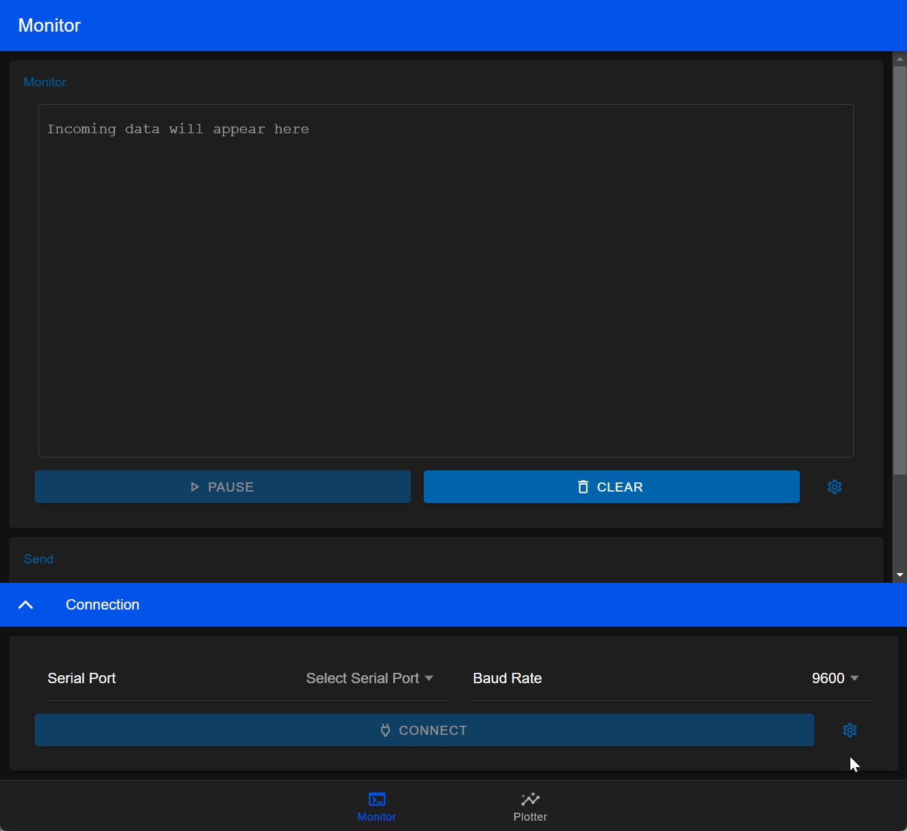
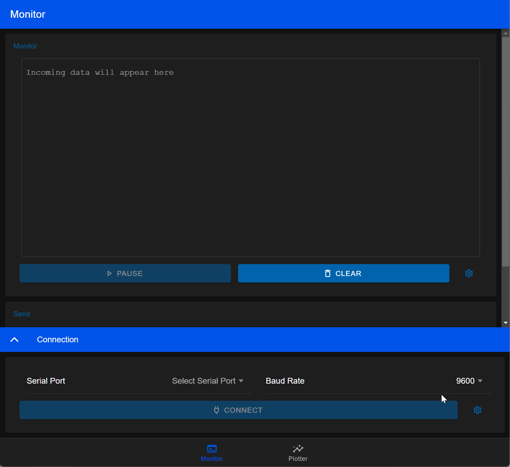

<p align="center">
  
<h3 align="center">SPIE</h3>
</p>
<p align="center">
  
  <a
    href="https://github.com/robsonos/spie/actions/workflows/ci.yml"
    style="color: inherit; text-decoration: none;">
    
  </a>
  <a
    href="LICENSE"
    style="color: inherit; text-decoration: none;">
    
  </a>
  <br />
  <a
    href="https://github.com/robsonos/spie/releases"
    style="color: inherit; text-decoration: none;">
    
  </a>
  <a
    href="#contributors"
    style="color: inherit; text-decoration: none;">
    
  </a>
</p>

This repository helps you quickly set up and develop your serial port communication project. Built with **ElectronJS** and a modern **Ionic/Angular** front-end, it uses an **NX monorepo** structure for efficient project management.

The repository provides:

- Core functionality of Arduino's Serial Monitor, enhanced with tools to configure, monitor, and communicate with serial devices
- Core functionality of Arduino's Serial Plotter, enhanced with tools to select, zoom, export and visualize data
- Cross-platform desktop application (`windows`, `linux` and `macOS`)
- Hot-reloading to accelerate development and testing cycles
- Enforced code linting and formatting
- Enforced conventional commits
- Streamlined workspace management and remote caching with [NX](https://nx.dev/)
- CI/CD workflows
- Angular's signals and RxJS for reactivity and state management
- Unit testing examples
- E2E testing examples
- Automatic updates on new github releases (see [limitations](#limitations) for more details)
- Modern tech stack:
  | Package | version |
  | ---------- | ------- |
  | nodejs | 22.x.x |
  | angular | 19.x.x |
  | ionic | 8.x.x |
  | electron | 33.3.x |
  | nx | 20.2.2 |
  | typescript | 5.5.x |

For a demo, check the [sample binaries](https://github.com/robsonos/spie/releases).

## Index

- [Features](#features)
- [Getting started](#getting-started)
- [Nx tasks](#nx-tasks)
- [CI/CD workflows](#cicd-workflows)
- [Troubleshooting](#troubleshooting)

## Features

### Connection

<p align="center"><br></p>

### Sending Data

<p align="center"><br></p>

### Terminal

<p align="center"><br></p>

### Plotter

<p align="center"><br></p>

### Auto update

<p align="center"><br></p>

[Back to Index](#index)

## Getting Started

Firstly, ensure the following are installed:

- [Node.js](https://nodejs.org) (preferably using `nvm` for version management)
- [NX CLI](https://nx.dev) (`npm install -g nx`, or you can use `npx nx ...` if you prefer)

### Steps

1. Clone the repository:

```sh
git clone https://github.com/robsonos/spie
cd spie
```

2. Install dependencies:

```sh
npm i
```

3. Run the application:

```sh
nx run-many -t serve
```

### Sample Arduino code

If you want a minimalistic two way serial example, use the following:

```cpp
#include <Arduino.h>

int period = 1000;
unsigned long time_now = 0;

void setup() {
  Serial.begin(115200);
}

void loop() {
  if (Serial.available() > 0)
    Serial.write(Serial.read());

  if (millis() > time_now + period) {
    time_now = millis();
    Serial.print("Hello World ");
    Serial.println(millis());
  }
}
```

For a example used on the plotter images, check out [spie-firmware](https://github.com/robsonos/spie-firmware).

### Plotter

The Plotter expects a line feed LF (`\n`) to separate records. Ensure that there is a linebreak character after the last variable in each record.  
You can use different delimiters to separate variables within a record: space (` `), tab (`\t`), or comma (`,`).  
For labeled data, the plotter can interpret variables in the format `<label>:<value>`.  
The Plotter supports parsing single and multiple variables in each record, handles duplicates for the same
variable label, and correctly groups the data under their respective labels.

Examples:

Single variable: `1\n`, `2\n`  
Multiple variables: `1,2\n`, `3,4\n`  
Multiple labeled variables: `temp1:1,temp2:2\n`, `temp1:3,temp2:4\n`

[Back to Index](#index)

## NX tasks

Learn more about NX in this [Angular Monorepo tutorial](https://nx.dev/getting-started/tutorials/angular-monorepo-tutorial?utm_source=nx_project&utm_medium=readme&utm_campaign=nx_projects).
Here are the most commonly used NX tasks:

- Serve the applications:

```sh
nx run-many -t serve
```

> [NOTE]
> If you see a blank screen, that will be because `spie` finished building before `spie-ui`.
> You can reload the web application with either `CTRL+R` on the `develop tool window` or typing `r` followed by
> `ENTER` on the terminal window.
> Alternatively, you can run `nx run spie-ui:serve` first and then `nx run spie:serve`.

- Lint the code:

```sh
nx run-many -t lint
```

- Run unit tests:

```sh
nx run-many -t test
```

- Run e2e tests:

```sh
nx run-many -t e2e
```

- Build the applications (development):

```sh
nx run-many -t build

```

- Build the applications (production):

```sh
nx run-many -t build --prod
```

- Build and generate unpacked executables:

> [!WARNING]
> Build the applications first

```sh
nx run spie:package
```

Output files are located in `dist\packages`

- Build and generate the executables:

> [!WARNING]
> Build the applications first

```sh
nx run spie:make
```

Output files are located in `dist\executables`

[Back to Index](#index)

## CI/CD workflows

There are many ways CD/CI workflow can be implemented. I chose the most convenient one and here is how it is meant to work:

- `dev`: holds the development code. Pushes to this branch will trigger the `CI workflow`, which will test the code that changes since the last release, and display a summary of the the next release.
- `main`: holds the code for the latest release. Pushes to this branch will trigger the `CD workflow`, which will create a new github release, a tag. New releases will then trigger the `Binaries workflow` to build and upload binaries the release.
- If you need to maintain more release channels, form instance `main` is at `v3.x.x` and you need to support `v1.x.x`, I would recommend using a similar approach:
  - `main` for `v3.x.x`
  - `main/v1` for `v1.x.x`
  - `dev` for `v3.x.x` development
  - `dev/v1` for `v1.x.x` development
- I may look into exemplifying the above and `pre-releases` in the feature

### act

You can use [act](https://github.com/nektos/act) to test workflows locally. Read more about `act` [here](https://nektosact.com/). Also, check out [.actrc](.actrc)

- CI

```shell
act push -W .github/workflows/ci.yml
```

- CD

```shell
act push -W .github/workflows/cd.yml
```

- Release

```shell
act release -W .github/workflows/release.yml -e  event.json
```

Sample `event.json`

```json
{
  "action": "created",
  "release": {
    "name": "v1.0.0",
    "tag_name": "1.0.0"
  }
}
```

[Back to Index](#index)

## Troubleshooting

- Serial data may be delivered in more than one `.on('data')` event. This means data received by the serialport library might arrive in multiple packets. For details, see [node-serialport/issues/659](https://github.com/serialport/node-serialport/issues/659). This is not a problem in most cases, but unexpected behavior may occur if you are trying to monitor data at a fast rate. A good way to demonstrate the issues is to send data every `5ms`, `115200` baud rate and with `show timestamps`. You will notice that every so often there is a "broken" message. If your data is terminated with a new line (`\n`) you can use `use readline parser` to alleviate that. If you are developing your own application, I would recommend using one of the [parsers](https://serialport.io/docs/api-parsers-overview) available.
- Depending on your operating system, the serial port ingestion may take a while, which could make the `plotter` look off when using `timestamp` instead of `sample count`.
- `macOS` application must be signed in order for auto updating to work. See [electron-builder Auto Update](https://www.electron.build/auto-update) for more details.

[Back to Index](#index)

## Contributors

<!-- ALL-CONTRIBUTORS-LIST:START - Do not remove or modify this section -->
<!-- prettier-ignore-start -->
<!-- markdownlint-disable -->

<!-- markdownlint-restore -->
<!-- prettier-ignore-end -->

<!-- ALL-CONTRIBUTORS-LIST:END -->

[Back to Index](#index)

<!-- TODO:
- repo:
	- code coverage badge
	- pre-release
	- protect main branch
- spie-ui
	- tour
	- stop/play button logic
  - settings page
    - dark mode
    - i18n
	  - show current version
	  - OSS licenses
- spie
	- Logger: libs/logger/src/lib/serializers/serialize-dev-log.ts, https://www.npmjs.com/package/electron-log
	- better error messages
-->
